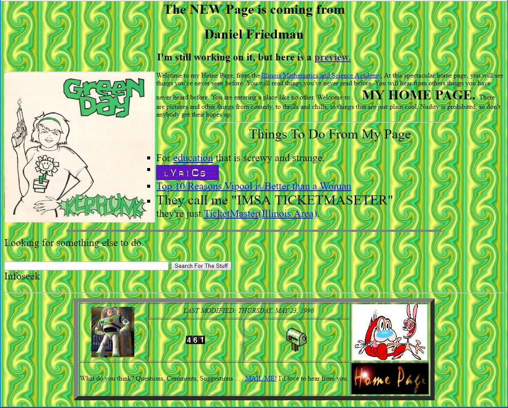

Title: Hello World... Again
Published: 5/22/2018
Tags:
 - history
 - web
Image: ../images/hello-world-again.jpg
---
I created my [first web page](https://web.archive.org/web/19970606013147/http://www.imsa.edu:80/~greenday/) in 1994 while a student at the [Illinois Mathematics and Science Academy](https://www.imsa.edu/). At the time, web programming didn't exist. There was HTML, but there was no CSS or JavaScript.

Now, it's probably hard imagine such a scenario, but it existed. HTML was invented in 1990, JavaScript in 1995, and CSS in 1996. These were the early days of the web.

Thanks to the [Wayback Machine](https://en.wikipedia.org/wiki/Wayback_Machine), I'm been able to find an old version of my web site. The Wayback Machine is like a digital archive of the entire internet. It started in 1996, so I've been making websites longer than its existance. (I feel old.)

Anyway, here's my [first known](https://web.archive.org/web/19970606013147/http://www.imsa.edu:80/~greenday/) web page:



And here's a glorious snippet from that page:

```html
<base font="+2">
<h1 align="CENTER">The NEW Page is coming from</h1>
<h1 align="CENTER">Daniel Friedman</h1>
<h2 align="CENTER">I'm still working on it, but here is a 
<a href="index2.html">preview.</a></h2>

<!-- snipped for brevity -->
You are entering a place like no other. Welcome to . . . <font size="+3"><b>MY HOME PAGE.</b> </font>There are pictures and other things 
from comedy, to thrills and chills, to things that are just plain cool. 
Nudity <i>is</i> prohibited, so don't anybody get their hopes up.
<hr size="2" width="50%">
<center>
<font size="+3">
Things To Do From My Page<br>
</center>
<font size="+2">
<ul type="SQUARE">
<!-- snipped for brevity -->
</ul><hr width="75%" size="5" noshade>
Looking for something else to do.<p>
<form method="get" action="http://netsearch.infoseek.com/IS/Titles">
<input name="qt" size="50" value="">
<input type="submit" value="Search For The Stuff"><br>Infoseek</form>
<hr>
<center>
<table border="10" cellspacng="10">
<tr align="CENTER">
   <td rowspan="2"></td>
   <td colspan="2"><em>LAST MODIFIED: THURSDAY, MAY 23, 
1996</em></td>
   <td rowspan="2"></td>
</tr>
<tr align="CENTER">
   <td></td>
   <td><a href="mailto:greenday@imsa.edu"></a></td>
</tr>
<tr align="CENTER">
   <td colspan="3">What do you think? Questions, Comments, Suggestions . . 
. <a href="mailto:greenday@imsa.edu">MAIL ME!</a> I'd love to hear 
from you.</td>
   <td><a href="index.html"></a></td>
</tr>
</table>
</center>
```

**Interesting things to note:**
 - My first concert was from Green Day's Dookie tour in 1994 in Chicago ([recorded](https://youtu.be/naP1viOewiM))
 - `center` and `font` tags are no longer supported.
 - `align` attributes are no longer supported.
 - I can't find anything to prove this was ever valid HTML: `<base font="+2">`. Maybe I meant `<basefont size="+2">`? Even so, the `+` seems to be invalid as well. Either way, no longer supported.
 - Using `table` for non-tabular data is a big no-no these days, but it was the only way back then since there was no CSS.
 - No instances of `div` or `span` tags
 - Cross posting to one of the most popular search engines, "Infoseek"
 - I had a page counter! They were all the rage. It worked by acccessing some global script on the server, which had to be approved and installed by the admins. (This was the only script I was aware of for our server.)
 - No JavaScript
 - No CSS
 - No templates
 - No frameworks

The experience of creating this page (and site), led to me enrolling in programming courses and I quickly realized what I wanted to do for the rest of my life. Create software with technology. With little to no investment, I could create amazing, new things. And for the last 24 years, that's precisely what I've done.