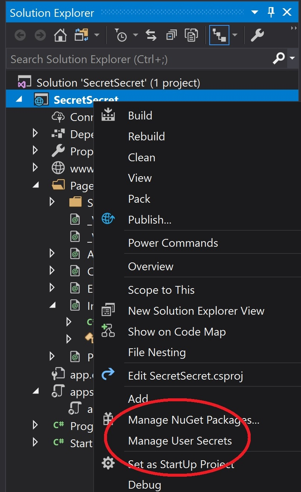

Title: Keeping Secrets
Published: 6/11/2018
Tags:

- ASP.NET Core
- .NET Core
- .NET Framework
- configuration
- web
- Azure
- Azure Web App
- Azure Key Vault
- cloud

Image: ../images/keeping-secrets.jpg
---

Config values can be used for multiple purposes. This post will address how we sometimes use them and how we can be more secure.

Topics:

- [Why Configuration?](#why-configuration)
- [Committing is Sharing](#committing-is-sharing)
- [Unsharing?](#unsharing)
- [User Secrets](#user-secrets)
- [Azure Key Vault](#azure-key-vault)

## Why Configuration?

- Changing behavior, credentials or endpoints
- Turning on and off experiments or new features (feature flags)
- Storing any value that we don't want to hard code or that we want to be able to change without rebuilding

Some inconsequential configuration data could be shared and no one might care. But some of it is sensitive and you want it shared with as few people as possible. Sometimes, even you shouldn't know the final config values! This is OK.

## Committing is Sharing

People often commit sensitive data to their source control repo, either by accident or for simplification purposes. Sometimes it's open source, sometimes is closed/commercial source. Whatever the reason, it's bad.

Committing secrets is just asking for trouble. It's an invitation for someone to mess with us. Only give out secrets to those you completely trust, who absolutely need them and then give them to as few people as possible. This is the [principle of least privilege](https://simplicable.com/new/principle-of-least-privilege).

## Unsharing?

Once a secret is committed to a central repo, it's almost impossible to fully take it back. You can try deleting it via a forced rewrite, but what if someone downloaded your repo in the meantime? Now they have the secret, and the potential to re-commit it. Once a secret is _potentially_ in the wrong hands, your best bet is to change the secret. Is it a password? Change it. A API key? Reset it. If a shared secret **cannot** be changed, then you should no longer feel secure that it's still a secret. So let's discuss some ways to keep secrets secret.

## User Secrets

User Secrets is a feature in Visual Studio and the dotnet CLI that allows you to store your secrets in a protected folder in your Windows profile, and away from your source code!

To use User Secrets, right-click the project and select "Manage User Secrets":



This will accomplish two things

 1. It will add a new line to your `csproj` file:

```xml
<UserSecretsId>[user-secrets-id]</UserSecretsId>
```

 2. It will create a `secrets.json` file stored in `%APPDATA%\Roaming\Microsoft\UserSecrets\[user-secrets-id]\secrets.json`

`user-secrets-id` is a randomly generated GUID and, of course, ties the project to the appropriate file/secrets, without the potential for accidental commits.

Using it is easy, as it is built into ASP.NET Core project templates by default. What you'll see in `Program.cs` is this:

```csharp
public static IWebHostBuilder CreateWebHostBuilder(string[] args) =>
    WebHost.CreateDefaultBuilder(args)
        .UseStartup<Startup>();
```

But under the covers, `CreateDefaultBuilder` is looking for and loading our User Secrets.

From the [aspnet/MetaPackages](https://github.com/aspnet/MetaPackages/blob/2.1.0/src/Microsoft.AspNetCore/WebHost.cs#L162-L174) repo:

```csharp
config.AddJsonFile("appsettings.json", optional: true, reloadOnChange: true)
        .AddJsonFile($"appsettings.{env.EnvironmentName}.json", optional: true, reloadOnChange: true);

if (env.IsDevelopment())
{
    var appAssembly = Assembly.Load(new AssemblyName(env.ApplicationName));
    if (appAssembly != null)
    {
        config.AddUserSecrets(appAssembly, optional: true);
    }
}

config.AddEnvironmentVariables();
```

You can see that User Secrets (`AddUserSecrets`) are read right after reading the JSON files and right before reading the environment variables, but only in development.

## Environment/Azure App Settings

I just wanted to quickly point out that there is no provider to just read Azure App Settings. Internally, Azure App Settings are all stored as environment variables, so we only need to use `AddEnvironmentVariables` and we are set.

## Azure Key Vault

Azure Key Vault is a feature of Azure for protecting our secrets. It encrypts our secrets and then safely stores them for us. Key Vault adds some complexity to the process, but is probably worth the effort in production/enterprise environments.

Somewhat like User Secrets, we are storing the secrets away from the app. This means users who have read access to a Web App, won't be able to immediately see those secrets. (Out of sight, out of mind.)

Another advantage is that you can programmatically update secrets without touching the app at all. And because the vault keeps our secrets centralized, we can have multiple apps accessing the same secret. Now, any updates or management can all happen in one place.

I will not go over how to set up Azure Key Vault, mainly because it's just boring setup work, but also because [it's been done](https://docs.microsoft.com/en-us/azure/architecture/multitenant-identity/key-vault).

Back to coding: The Azure Key Vault configuration provider is not (currently) built into the ASP.NET Core templates, so we need to manually add that one. After referencing [the Nuget package](https://www.nuget.org/packages/Microsoft.Extensions.Configuration.AzureKeyVault/), you just need to add the following code to `Program.cs`:

```csharp
public static IWebHostBuilder CreateWebHostBuilder(string[] args) =>
    WebHost.CreateDefaultBuilder(args)
        .ConfigureAppConfiguration((context, config) =>
        {
            var builtConfig = config.Build();

            config.AddAzureKeyVault(
                $"https://{builtConfig["Vault"]}.vault.azure.net/",
                builtConfig["ClientId"],
                builtConfig["ClientSecret"]);
        })
        .UseStartup<Startup>();
```

You'll notice that you need three settings... that come from app settings... while we are setting up app settings. :)

What's happening here is that the configuration chain is built, without including Azure Key Vault. We use that to retrieve whatever values currently exist in the configuration and then add the Azure Key Vault provider (with it's values) to the configuration chain.

NOTE: This is all done once at startup and secrets are cached until `Configuration.Reload();` is run.

## Put it all together

This whole post was inspired from a code review I did and saw this in an ASP.NET controller:

```csharp
string environment = Configuration.GetSection("Environment").Value;
if (environment != "local")
{
    this.ConnString = KeyVaultHelper.SqlConnectionString;
}
else
{
    this.ConnString = Configuration.GetSection("SQLConnection:ConnectionString").Value;
}
```

This exactly what we _don't_ want to do. We want to avoid alternate paths as much as possible for the sake of simpler, easier to test, easier to read code. So how can we fix this? First off, how _would_ I want to code this? I'd like to see it look like this:

```csharp
this.ConnString = Configuration.GetSection("SQLConnection:ConnectionString").Value;
```

That's right! One. Simple. Line.

First off, it's helpful to know that there is no parameter to make the Azure Key Vault configuration provider optional, so we'll have to make our own magic. Using the code from earlier, we'll just add an `if` statement. Tada!

```csharp
.ConfigureAppConfiguration((context, config) =>
{
    var builtConfig = config.Build();

    if (builtConfig["Environment"] != "local") // Or builtConfig["Environment"] != EnvironmentName.Development)
    {
        config.AddAzureKeyVault(
            $"https://{builtConfig["Vault"]}.vault.azure.net/",
            builtConfig["ClientId"],
            builtConfig["ClientSecret"]);
    }
})
```

Now we can remove our `if` from the controller and figure out how to merge these two lines into one:

```csharp
this.ConnString = KeyVaultHelper.SqlConnectionString;
// and
this.ConnString = Configuration.GetSection("SQLConnection:ConnectionString").Value;
```

The greatness of the configuration provider pattern is that no matter what the configuration source, we access the settings in the same way. So all we need is:

```csharp
this.ConnString = Configuration.GetSection("SQLConnection:ConnectionString").Value;
```

Or we could even simplify this further to:

```csharp
ConnString = Configuration.GetSection("SQLConnection")["ConnectionString"];
```

There's one small, but important, caveat here. In order for the configuration provider to work, everything has to be able to map from a single input to various different sources.

So while `Configuration.GetSection("SQLConnection")["ConnectionString"]` would look in a JSON file for the following setting:

```json
{
    "ConnectionStrings": {
        "SomeConnectionString": "some non-secret app setting"
    }
}
```

In Azure Key Vault, we would just look for a secret named `ConnectionString--SomeConectionString`.

Hope that helps. Feel free to hit me up with any questions (or gratitude) in the comments below.